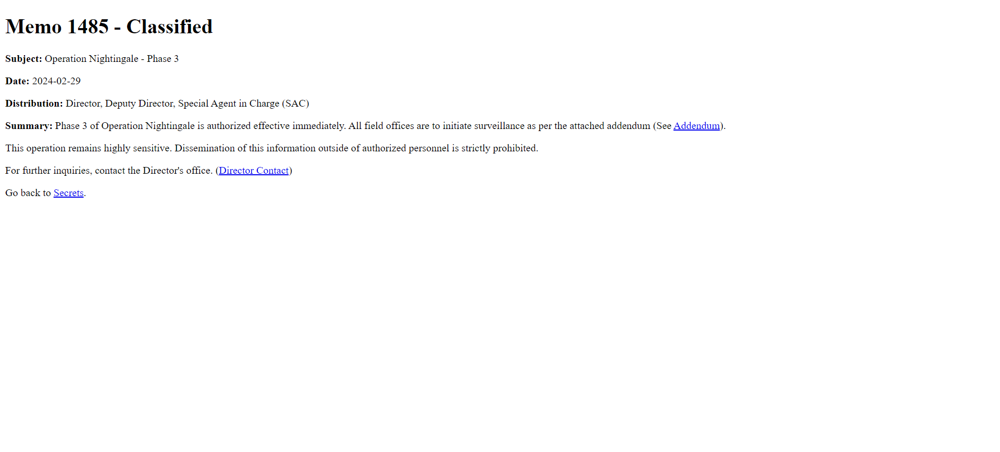
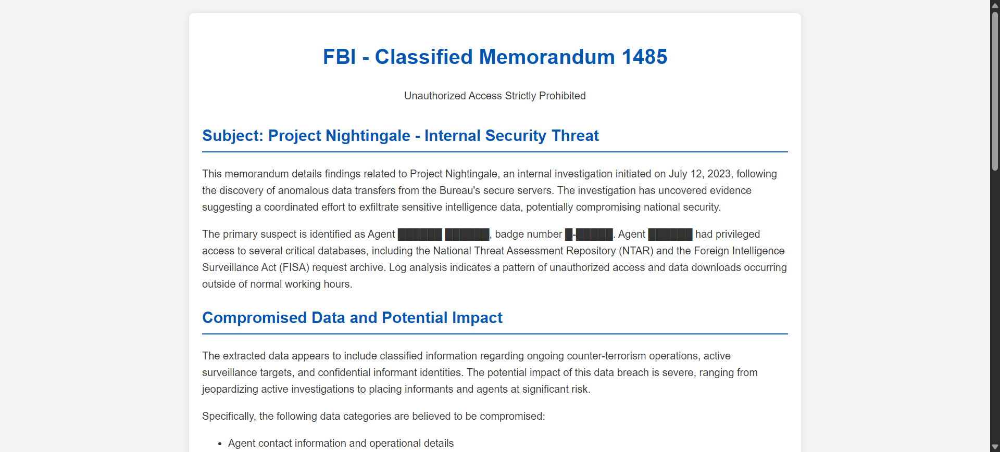

# INFINITE AI WEB


A dynamic web content generator that creates pages on-the-fly using AI. Simply search for any topic or navigate to any URL path, and the application will generate relevant content for that route.

## 📈 Development

### v0.1



### v1



## 🌟 Features

- **AI-Generated Content**: Uses Google's Gemini 2.0 Flash model to generate HTML content for any URL path.
- **Dynamic Routing**: Visit any URL path to get AI-generated content specifically for that path.
- **Search Interface**: Simple search functionality that redirects to the generated content.
- **Content Persistence**: Automatically saves generated content to the filesystem for faster access in future requests.
- **Organized Structure**: Maintains proper directory structure based on URL paths.
- **Index of Saved Content**: Automatically generates an index of all saved pages.

## 🚀 Getting Started

### Prerequisites

- Python 3.7 or higher
- Google Gemini API key

### Installation

1. Clone this repository:
   ```
   https://github.com/TheLime1/infinite-ai-web
   cd infinite-ai-web
   ```

2. Install the required dependencies:
   ```
   pip install -r requirements.txt
   ```

3. Create a `.env` file in the project root with your Google Gemini API key:
   ```
   GEMINI_API_KEY=your_api_key_here
   ```

### Running the Application

Run the Flask application:
```
python infinite_web.py
```

The server will start at http://localhost:5000 by default.

## 🧭 Usage

1. **Homepage**: Visit the root URL `/` to see the search interface.
2. **Direct Path Navigation**: Enter any path like `/python-tutorial` or `/history/ancient-rome` in your browser to generate content for that topic.
3. **Search**: Use the search box to look for a topic. The search will convert your query to a URL path and generate content.
4. **View Saved Pages**: Click on "Saved Searches" to see an index of all previously generated pages.

## ⚙️ How It Works

1. When a user visits a URL path, the application first checks if content has been previously generated and saved.
2. If found, the application serves the saved content.
3. If not found, the application generates the content using the Gemini AI model.
4. The AI-generated content is then saved to the file system for future requests.
5. The application maintains a proper directory structure that matches the URL path structure.

## 🛣️ Roadmap

- [ ] generate more complex content
- [ ] generate images
- [ ] toggle between different AI models
- [ ] generate links to external sources
- [ ] generate links that go deeper into the topic
- [ ] automate HTML dumbing to another repo with a cron job
- [ ] make diffrent colors for links (links not generated yet vs links generated and saved vs external links)

## 🤝 Contributing

Contributions are welcome! Please feel free to submit a Pull Request.
